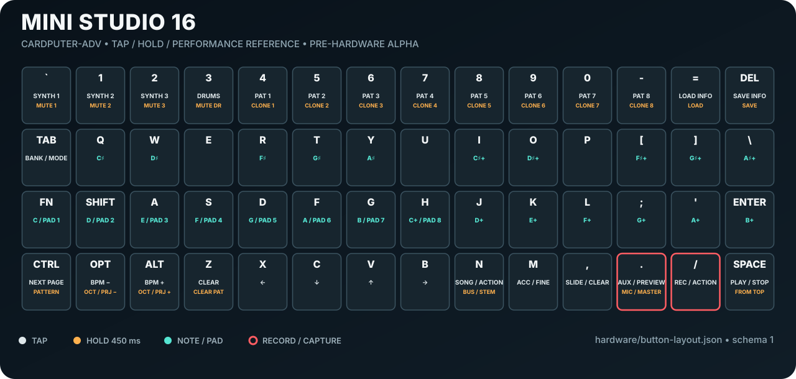

# Mini Studio 16

SD-backed groovebox, multi-engine synthesizer, sampler, looper, motion
controller, recorder, and MIDI firmware for the **M5Stack Cardputer-ADV**.

[](LICENSE)
[](https://github.com/CanadaOrNaw/Mini-Studio-16/actions/workflows/build-v3-alpha.yml)
[](https://canadaornaw.github.io/MiniStudio.github.io/)

**[Open the Mini Studio 16 project site →](https://canadaornaw.github.io/MiniStudio.github.io/)**

> **Pre-hardware validation alpha.** The complete software paths described
> below are implemented and built in CI. They have not yet been flashed or
> stress-tested on a physical Cardputer-ADV, so timing, audio quality, USB
> enumeration, BLE behavior, IMU calibration, and SD-card limits remain
> hardware gates—not claims.

Mini Studio 16 is an independent fork of
[Microgroove](https://github.com/matoslav/MicroGroove). It retains the original
instrument and adds the requested long-audio and control systems; it is not an
official Microgroove or lebiro.studio release.



## Print it. Flash it. Play it.

1. **Print:** download the original
   [Mini Studio 16 bench-cradle STL](hardware/stl/mini-studio-16-bench-cradle.stl)
   and [full-resolution SVG key legend](hardware/mini-studio-16-button-layout.svg).
2. **Flash:** build locally or download the verified GitHub Actions artifact;
   write the combined image once at offset `0x0`.
3. **Play:** insert a FAT32 microSD card and choose computer-facing USB Device
   or controller-facing USB Host at startup. Switching roles requires a reboot,
   not another flash.

The cradle and label are deterministic checked-in assets. Their topology,
dimensions, references, and site downloads are tested on every host run. The
first physical print/fit remains a hardware gate; see
[`hardware/README.md`](hardware/README.md) before printing.

## Implemented instrument

| System | Implemented software | Remaining proof |
| --- | --- | --- |
| Synthesis | Per-track selectable original `MG/303`, expanded subtractive `MGX`, or genuine four-operator `FM4`; fixed-size DSP, banked SOUND UI, velocity/note-off, automation, CLI, and GBX v8 persistence | Real render time and safe simultaneous FM polyphony under full device load |
| Six-track audio looper | Six independent 22.05 kHz mono SD streams, up to 20 seconds; Track 1 fixes the frame length; tracks 2–6 align to its boundary; mute, volume, recovery, and resync | Zero-underrun playback and simultaneous recording on the actual card |
| PO-style sampler | 16 SD-streamed slots sharing a normalized 40-second quota; melodic/sliced modes, 16 slices, trim, pitch, gain, filter, four voices, pattern triggers, and sparse parameter locks | Performance and latency on the actual SD card |
| Sequencer | 16 patterns × 16 steps and a 128-entry chain | Keyboard/UI usability pass |
| Event looper | Five role-mapped drum/bass/chord/lead/sample-control tracks, 1–128 bars, 2,048 events, arm/mute/clear | Long-run timing and live workflow |
| Motion | BMI270 filtering, tilt/accel/gyro/shake/slap sources, four mappings, synth cutoff/resonance targets, MIDI CC, and recordable automation | IMU calibration and gesture thresholds |
| MIDI/boot | BLE MIDI input/output; composite USB CDC+MIDI device app; direct USB-MIDI host app; combined dual-slot image with validated on-device role selector and reboot; notes, CC, clock, song position, start/continue/stop | Bidirectional role switching, enumeration, reconnect, clock jitter, OTG/VBUS behavior |
| Recording | Long master WAVs and optional five-bus master/synth1/synth2/synth3/drums stem containers on SD | Zero-drop 30-minute captures and power-cut cycles |
| Control | Bounded `MS16/1` USB serial protocol, desktop CLI, JSON, monitor, discovery, fuzzing, and soak client | Device-side 10,000-command soak |
| Existing Microgroove | Original `SynthVoice` DSP and workflow remain the default `MG/303` engine; three synth tracks, eight drum lanes, keyboard, short sampler/resampler gestures, speaker, mic, headphones, projects, and factory content retained; samples use adaptive RAM or transparent SD-stream fallback | Regression pass on hardware |
| Expanded audio | One-plug Cardputer-powered Audio Cap: off-the-shelf ATOM Lite + PCM1808, solderless harness, line input, A2DP output, fixed bridge firmware, CLI and two-part snap enclosure | Physical fit, 5VOUT budget, analog quality, SPI soak and Bluetooth compatibility |

The DAW is optional: songs can be captured to master WAV or exported as five
stems without removing any inherited standalone workflow.

## What is already verified without hardware

- Both ESP32-S3 images compile and link in the pinned PlatformIO toolchain.
- The normal image provides native USB CDC plus class-compliant USB MIDI device
  support; the alternate image builds the ESP-IDF USB-host class driver.
- Host tests cover loop synchronization/stalls, streamed sample pitch/EOF/
  underrun/voice stealing, sampler quota/slices/locks, the 128-bar event model,
  motion filtering/cooldowns, MIDI parsing/transport, BLE framing, USB-MIDI host
  descriptor parsing, WAV/stem recovery, project layouts, protocol fuzzing,
  CLI behavior, concurrent ring ordering, the exact legacy synth PCM vector,
  ADSR/operator/algorithm/ratio/feedback/engine switching, GBX v8 synthesis
  migration, deterministic offline FM waveform/spectrum statistics, dual-role
  selection/recovery decisions, partition bounds, and exact image placement.
- GitHub runs the host suite plus AddressSanitizer and UndefinedBehaviorSanitizer.
- Firmware size is checked from the ESP32 linker sections using the same DRAM
  accounting rules as PlatformIO, with a 200 KiB static-DRAM ceiling so runtime
  workers, wireless stacks, and the 8-bit UI canvas retain heap.
- GBX v8 persists the expanded sequencer, sampler, locks, event tracks, motion
  mappings, six-loop mixer, and all per-track engine patches while retaining
  v1–v7 loading as the original `MG/303` engine.
- Every long-audio subsystem uses bounded RAM rings; SD files are owned by
  storage workers, not opened or touched by the real-time renderer.
- The inherited mic-to-drum and short-resample gestures use the streamed
  recorder when the adaptive RAM pool is unavailable, avoiding an 84 KiB
  whole-take scratch allocation without removing those workflows.
- Interrupted master, stem, loop, and streamed-sample temporary files are
  recovered when structurally valid or preserved as `.bad` for diagnosis.

The exact evidence boundary is maintained in
[`docs/BUILD_STATUS.md`](docs/BUILD_STATUS.md).

The static project site is source-controlled in [`site/`](site/) and built by
GitHub Actions. Its interactive keyboard and the printable legend share
[`hardware/button-layout.json`](hardware/button-layout.json), preventing the
two maps from drifting independently.

## Build and flash

Never flashed an ESP32 before? Start with
[`docs/START_HERE.md`](docs/START_HERE.md), then use the no-compilation
[`docs/FLASHING.md`](docs/FLASHING.md) walkthrough. The commands below are the
developer path.

Build the normal computer-facing image:

```bash
pio run -e m5stack-cardputer-adv
```

Build the alternate direct-controller USB-host image:

```bash
pio run -e m5stack-cardputer-adv-usb-host
```

Build and pre-flash the optional ATOM Lite Audio Cap before assembling it:

```bash
pio run -e mini-studio-audio-cap-atom-lite
pio run -e mini-studio-audio-cap-atom-lite -t upload --upload-port /dev/ttyUSB0
```

Upload the normal image over USB:

```bash
pio run -e m5stack-cardputer-adv -t upload --upload-port /dev/ttyACM0
```

CI publishes a combined dual-role image that flashes at offset `0x0`:

```bash
esptool.py --chip esp32s3 write_flash 0x0 mini-studio-16-dual-role.bin
```

On the startup screen, press `Tab` to validate/select the other USB role and
reboot; press any other key to continue. Normal mode is selected after the
initial flash. See [`docs/DUAL_BOOT.md`](docs/DUAL_BOOT.md).

Each artifact includes `SHA256SUMS.txt`, `BUILD_INFO.txt`, both Cardputer
application ELFs/images, both standalone Cardputer recovery images, the
combined dual-role image and layout report, the one-file ATOM Lite Audio Cap
image, both resource reports, beginner flashing/build guides, the license, and
a `Mini-Studio-16_SD.zip` starter card image. Verify the extracted artifact with
`sha256sum -c SHA256SUMS.txt` before flashing. The starter image is packaged
with normalized metadata so identical source trees produce identical ZIPs.

The standalone `microgroove-v3-alpha.bin` and
`microgroove-v3-alpha-usb-host.bin` remain available for recovery and
profile-specific debugging. The ESP32-S3's single native USB PHY still cannot
serve both roles simultaneously, so selecting a role always reboots into its
separately compiled slot.

Run all desktop checks:

```bash
bash tests/run_host_tests.sh
bash tests/run_sanitizers.sh
```

Follow [`docs/CARDPUTER_TESTING.md`](docs/CARDPUTER_TESTING.md) when the device
arrives. Back up the SD card before flashing development firmware.

## Standalone controls added by Mini Studio 16

Tap `ctrl` to cycle through the original and new pages.

| Page | Controls |
| --- | --- |
| Startup selector | `Tab` validates/selects the other installed USB role and reboots; any other key starts the displayed role |
| SOUND synth | `tab` cycles the selected engine's small parameter banks; `v/c` selects a row; `x/b` edits; hold `m` for fine edits; COMMON selects `MG/303`, `MGX`, or `FM4` |
| SAMPLE browser | `x/b` chooses slot, `v/c` chooses WAV, `/` assigns; hold `.` records mic; hold `n` records master bus |
| SAMPLE performance | 16 white/performance keys trigger pitches or slices; REC writes quantized events |
| SAMPLE edit | `tab` cycles browser/sound/step-lock; `v/c` selects parameter; `x/b` edits; hold `m` + `x/b` selects step; `/` clears a lock; `,` clears the sample event |
| LOOPS | `v/c` selects L1–L6, `x/b` changes volume, `/` records/stops, `.` mutes, `z` clears |
| EVENT | `v/c` selects one of five tracks, `x/b` changes bar length, `/` arms, `.` mutes, `z` clears |
| MOTION | `v/c` selects mapping, `x/b` selects source, `.` advances target, `z` clears |
| SONG | Existing 128-chain controls remain; hold `.` toggles master recording and hold `n` toggles stem recording |
| SD TEST | `/` starts the diagnostic pass |

The original keys, synth/drum performance, mic sampling, short resampling,
pattern editing, project slots, and song controls remain available. See
[`docs/USER_MANUAL.md`](docs/USER_MANUAL.md) for the complete map.
The engine architecture, algorithms, parameter units, and compatibility
contract are documented in [`docs/SYNTHESIS.md`](docs/SYNTHESIS.md).

## Remote control

Install `pyserial` and use the checked-in CLI:

```bash
python -m pip install pyserial
python tools/ministudio_cli.py ports
python tools/ministudio_cli.py --port /dev/ttyACM0 status
python tools/ministudio_cli.py --port /dev/ttyACM0 loop 1 record
python tools/ministudio_cli.py --port /dev/ttyACM0 loop 1 volume 80
python tools/ministudio_cli.py --port /dev/ttyACM0 sample-record 1 bus melodic
python tools/ministudio_cli.py --port /dev/ttyACM0 master start
python tools/ministudio_cli.py --port /dev/ttyACM0 master stop
python tools/ministudio_cli.py --port /dev/ttyACM0 --json midi-status
python tools/ministudio_cli.py --port /dev/ttyACM0 synth-engine 1 fm4
python tools/ministudio_cli.py --port /dev/ttyACM0 synth-set 1 fm.op2.ratio 200
python tools/ministudio_cli.py --port /dev/ttyACM0 synth-status
python tools/ministudio_cli.py --port /dev/ttyACM0 boot-status
python tools/ministudio_cli.py --port /dev/ttyACM0 boot-mode host
python tools/ministudio_cli.py --port /dev/ttyACM0 cap-status
python tools/ministudio_cli.py --port /dev/ttyACM0 cap-monitor 25
python tools/ministudio_cli.py --port /dev/ttyACM0 cap-pair
python tools/hardware_smoke.py --port /dev/ttyACM0 --sd-test \
  --output cardputer-smoke.json
```

The bounded wire protocol and every command are documented in
[`docs/CONTROL_PROTOCOL.md`](docs/CONTROL_PROTOCOL.md).

## SD layout and audio formats

Use a FAT32 microSD card for the first hardware pass:

```text
/groovebox/
├── projects/       P1.gbx–P8.gbx, current write version GBX v8
├── samples/        adaptive RAM/streamed drum samples and 16-slot WAV assets
├── wavetables/     optional single-cycle WAVs
├── loops/          L1.wav–L6.wav and recovery files
├── recordings/     master WAVs, stem containers, and recovered takes
└── diag/           temporary benchmark files, removed after the test
```

Long internal audio uses 22,050 Hz mono signed 16-bit PCM. The streamed sampler
accepts mono 16-bit WAV assets and normalizes their duration to the engine rate
for the 40-second quota. Legacy Microgroove sample loading remains intact.

## Architecture

```text
microSD ⇄ SD arbiter/storage workers ⇄ bounded RAM rings ⇄ core-0 renderer ⇄ ES8311
```

The audio task never performs filesystem calls. Storage stalls become counted
underruns or dropped frames, and every subsystem publishes buffer/error/latency
telemetry through the UI or `MS16/1` status commands. A recursive SD arbiter
serializes FatFS access across loop, sampler, recorder, diagnostics, and project
operations without moving file I/O into the render callback.

## Remaining gates

No additional software-only milestone is intentionally deferred. The next
required evidence depends on the physical Cardputer-ADV, the exact SD card, or
external expansion hardware:

1. flash the combined image; verify twenty Normal/USB-host round trips,
   selection-state power cuts, boot, heap/stack telemetry, display, keyboard,
   speaker, mic, and headphone regression;
2. SD throughput/stall diagnostics, six-stream playback, concurrent recording,
   long master/stem captures, and power-cut recovery;
3. BLE MIDI and USB device/host enumeration, reconnect, timing, cable, and VBUS;
4. BMI270 calibration and live event/motion workflow;
5. worst-case `MGX`/`FM4` render time and safe polyphony while all audio,
   storage, MIDI, event, and motion systems run;
6. lower-level ES8311 full-duplex experiments;
7. assemble the checked-in solderless Audio Cap; verify EXT 5VOUT current/sag,
   exact retail-module fit, analog input performance, SPI/clock soak, A2DP
   pairing/reconnect/latency, enclosure snaps and battery impact.

The cap architecture is specified in
[`docs/AUDIO_EXPANSION.md`](docs/AUDIO_EXPANSION.md), and the child-friendly
purchase/print/flash/assembly guide is
[`docs/AUDIO_CAP_BUILD_GUIDE.md`](docs/AUDIO_CAP_BUILD_GUIDE.md). Requirements,
regional sourcing, three printable meshes, transport/rate conversion, both
firmware sides and CLI are checked in; only physical evidence is outstanding.

Passing compilation or host tests does not substitute for those measurements.

## Upstream, attribution, and license

Mini Studio 16 is a modified fork of
[Microgroove](https://github.com/matoslav/MicroGroove), created by
[lebiro.studio](https://lebiro.studio) and published by
[matoslav](https://github.com/matoslav). Microgroove supplied the original
synth, drum, sequencing, sampling, UI, hardware, and project-storage foundation
used here. If that foundation is useful, visit the upstream project and
[support its creator](https://ko-fi.com/makarov87).

The upstream copyright and full MIT permission notice are retained unchanged in
[`LICENSE`](LICENSE):

> Copyright (c) 2026 lebiro.studio

Microgroove credits parts of its synth voice, 808 drum synthesis, and audio-task
architecture to
[Cardputer-Adv-Tracker](https://github.com/qwertyuu/Cardputer-Adv-Tracker) by
**qwertyuu**, also MIT licensed. That attribution remains in `LICENSE`. The
factory sample pack is identified upstream as CC0 by lebiro.studio.

SD-card research was informed by
[bmorcelli/Launcher](https://github.com/bmorcelli/Launcher), whose Cardputer SD
file-handling paths were a useful reference for chunked I/O and failure
behavior. No Launcher source code is included; this acknowledges research
influence rather than a code-derived license obligation.

All modifications are distributed under the same MIT License. “Mini Studio 16”
identifies this fork; “Microgroove” and the original artwork belong to their
respective upstream creators.

The optional cap firmware links Apache-2.0-licensed ESP32-A2DP by Phil
Schatzmann. Its attribution and license copy are in
[`THIRD_PARTY_NOTICES.md`](THIRD_PARTY_NOTICES.md).
